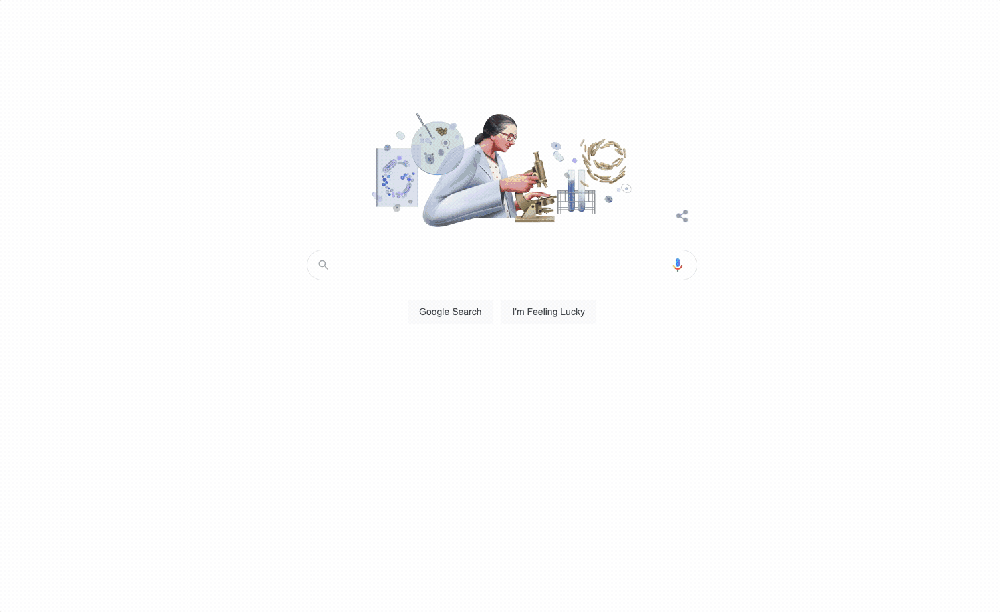
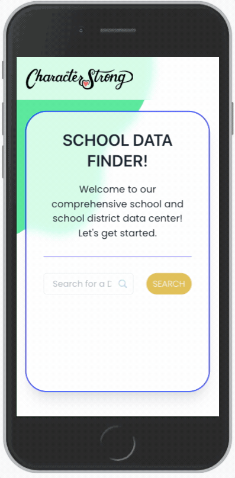

# **Mo's School Data Finder!**

## This prototype app...

🍩 searches for a US school district 
🍩 expands on a button click to show all associated schools  
🍩 expands _again_ on _another_ button click to show details about that school (including map location)  
🍩 is [mostly] responsive  
🍩 was super fun to build!

---

### [<u>Demo (</u>](https://chrismochinski.github.io/react-interview-exercise/)

## New Demo (Desktop):

## ...and Mobile: 
 

---

## Overview

Rather than basking in my comfort zone, I spent some time learning the basics of Chakra UI and diving deeper into Typescript (with which I wasn't familiar, originally). I'm thrilled to say that this gave me the opportunity establish a basic understanding of both. I absolutely love learning!

---

## Additional Dependencies

[React Icons](https://www.npmjs.com/package/react-icons) 

[React Google Maps API](https://www.npmjs.com/package/@react-google-maps/api)

## Notes / Improvements

- Like CharacterStrong, I am highly design oriented. The client-facing portion of an interactive experience is _super_ important in the grand scheme of things. If given the opportunity and project timeline, I would visually and interactively enhance parts of this UI, including an empty search field error toast and a flashier appearance of the expanding/additional content.
- While I didn't hard code the Google Maps API key, I would normally take steps to protect it on a backend. Additionally, I assume the developer map will suffice for this demo.
- Admission - I wasn't sure what the "k" search param was at a glance. I realized late in the game the intended functionality and, if given the opportunity and project timeline, I would append an additional input on district click that would further narrow the school search. For now, the string is blank and all schools in a district will appear when clicked.
- I'm a huge fan of learning, and I can't get enough of growing as a developer. I hope that shows in my excitement, and please forgive me for any rudimentary Typescript misses.

---

## Bottom Line

I'm thrilled to have been chosen as even a candidate for this role, and I appreciate the opportunity to have come this far! I'm super excited to see what the future holds. Please feel free to reach out with any questions, comments, updates etc. that you may have, and thank you so much again!

###### _Cheers,_

###### -_Chris "Mo" Mochinski_

---

_[My Website](https://chrismochinski.com)_  
_[My LinkedIn](https://www.linkedin.com/in/chrismochinski/)_  
_[My Twitter (@HolyMosesMusic)](https://twitter.com/holymosesmusic)_  
_[My GitHub](https://github.com/chrismochinski)_  

